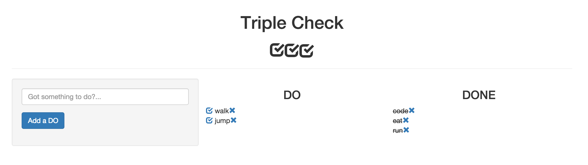

# Triple Check - To Do App

### Technologies Used
- MongoDB
- ExpressJS
- AngularJS
- NodeJS
- Javascript
- HTML/CSS

### General Approach
The purpose of the site is a To Do web application.  The approach I took was to make a basic CRUD app using full MEAN stack development.  I included Bootstrap to organize and beautify in a basic way the elements on my page.

I initially had wanted the app to be a new way to keep track of to do's and their progress with three checkmarks, but I narrowed it down to one in the interest of time.

### Installation Instructions
Dependencies
- npm: node package manager
- nodeJS: server/outside browser javascript-ing
- mongoDB: noSQL database
- angular: front end framework to enhance HTML
- body-parser: for reading front end posts on the back end
- express: as part of the node server setup
- mongoose: middleware for mongoDB
- morgan: logger for your console during development

Prior to installing this project, please setup NPM, NodeJS and MongoDB globally on your system.  There are many sites that walk you through this, so I won't repeat the instructions here.

For this program, you'll need to `npm install` angular, mongoose, morgan, express, and body-parser.  If you have cloned or forked this repo and you have installed the previously mentioned global software, you can type `npm install` in your CLI and you'll get the dependencies included in the package.json file in this repo.

From that point forward, it's up to you.

### User Stories / Wireframes / Pitch Deck
Not included as part of this design.  I set out to make a basic to do app with minimal beautifying to prove MEAN stack development and CRUD operations.

### Unsolved Issues
- Add triple checkbox functionality to meet original design intent.
